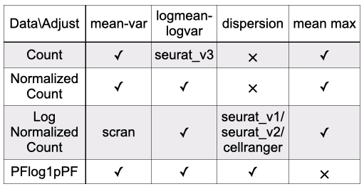
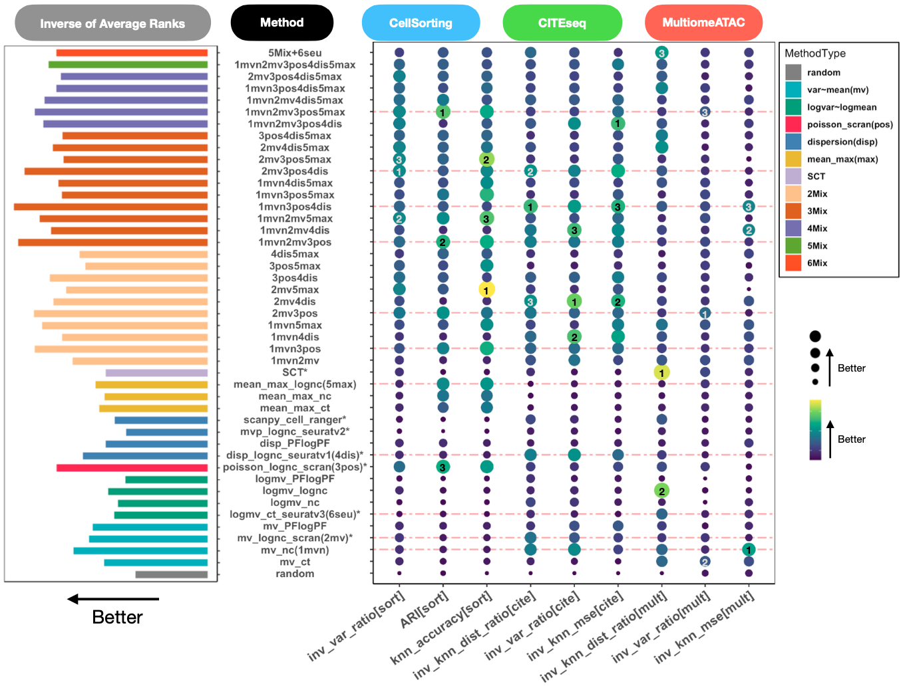

# README

The package **mixhvg** works for highly variable gene selection, including popular public available methods, and also the mixture of multiple highly variable gene selection methods. The mixture of methods can combine the advantages captured by each single method. 

This function **FindVariableFeatures2** inherits from FindVariableFeatures function of Seurat Package, which can be used the same as FindVariableFeatures. Also, it accepts the dense or sparse matrix input. 

Please use `devtools::install_github("RuzhangZhao/mixhvg")` to install the package.

The following methods can be chosen. And also, any mixture of the following methods is acceptable. For example, the default is c("scran","seuratv1","mv_PFlogPF","scran_pos")

**scran**: Use mean-variance curve adjustment on lognormalized count matrix, which is scran ModelGeneVar.
**mv_ct**: Use mean-variance curve adjustment on count matrix, inherited from scran ModelGeneVar.
**mv_nc**: Use mean-variance curve adjustment on normalized count matrix, inherited from scran ModelGeneVar.
**mv_lognc**: The same as scran.
**mv_PFlogPF**: Use mean-variance curve adjustment on PFlog1pPF matrix, inherited from scran ModelGeneVar.
**scran_pos**: Use scran possion version, modelGeneVarByPoisson.
**seuratv3**: Use logmean-logvariance curve adjustment on count matrix, which is vst, Seurat FindVariableFeatures Function(https://satijalab.org/seurat/reference/findvariablefeatures).
**logmv_ct**: The same as seuratv3.
**logmv_nc**: Use logmean-logvariance curve adjustment on normalized count matrix, inherited from seuratv3(vst).
**logmv_lognc**: Use logmean-logvariance curve adjustment on lognormalized count matrix, inherited from seuratv3(vst).
**logmv_PFlogPF**: Use logmean-logvariance curve adjustment on PFlog1pPF matrix, inherited from seuratv3(vst).
**seuratv1**: Use dispersion on lognormalized count matrix, which is dispersion (disp), Seurat FindVariableFeatures Function(https://satijalab.org/seurat/reference/findvariablefeatures).
**disp_lognc**: The same as seuratv1.
**disp_PFlogPF**: Use dispersion on PFlog1pPF matrix, inherited from seuratv1(disp).
**mean_max_ct**: Highly Expressed Features with respect to count matrix.
**mean_max_nc**: Highly Expressed Features with respect to normalized count matrix.
**mean_max_lognc**: Highly Expressed Features with respect to lognormalized count matrix

The table below can describe the data format and mean adjustment combination. 

 

The following figure shows how different methods perform. It includes both single highly variable gene selection methods and the mixture. We notice the 2mv3dis4pf5pos works best, which is the default setting: c("scran","seuratv1","mv_PFlogPF","scran_pos").

