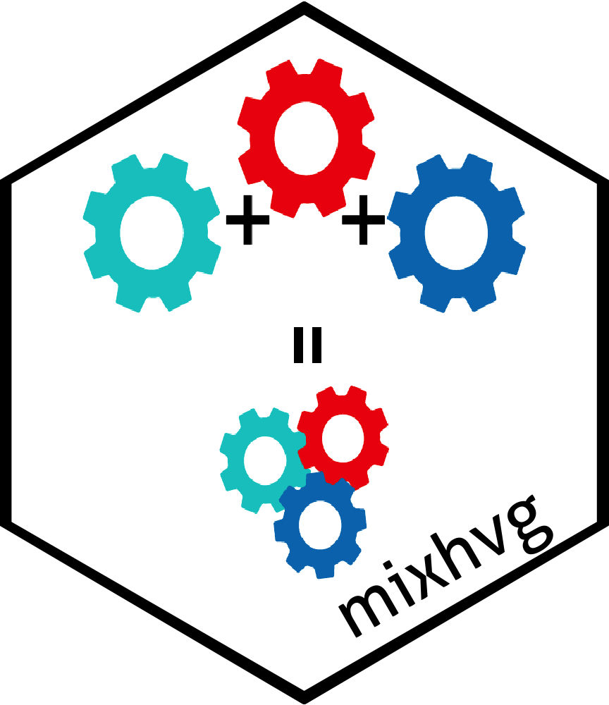
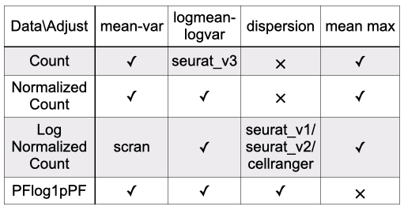

# mixhvg: Mixture of Highly Variable Gene Selection 

[](https://cran.r-project.org/package=mixhvg) [](https://cran.r-project.org/package=mixhvg)  

[](https://cran.r-project.org/package=mixhvg) 

[](https://cran.r-project.org/package=mixhvg)

### Overview

The package **mixhvg** works for highly variable gene selection, including popular public available methods, and also the mixture of multiple highly variable gene selection methods. The mixture of methods can combine the advantages captured by each single method. 

This function **FindVariableFeaturesMix** inherits from FindVariableFeatures function of Seurat Package, which can be used the same as FindVariableFeatures. Also, it accepts the dense or sparse matrix input. 

### Download

Please download the [**mixhvg** package from CRAN](https://CRAN.R-project.org/package=mixhvg).

```R
install.packages("mixhvg")
```

Please use GitHub repo to download the most updated package.

```R
devtools::install_github("RuzhangZhao/mixhvg")
```

 ### Usage 

There are two inputs can be used in **FindVariableFeaturesMix** function. 

The example data comes from [10x Genomics](https://www.10xgenomics.com/resources/datasets/pbmc-from-a-healthy-donor-granulocytes-removed-through-cell-sorting-3-k-1-standard-2-0-0). You may use [this link](https://github.com/RuzhangZhao/pbmc3k/raw/main/pbmc3k_rna.rds) to download the processed data. The processed data is named as `pbmc3k_rna.rds`.

#### Seurat Object as Input

```R
pbmc<-readRDS("pbmc3k_rna.rds")
library(Seurat)
library(mixhvg)
object<-CreateSeuratObject(pbmc)
object<-FindVariableFeaturesMix(object,nfeatures=2000)
head(VariableFeatures(object))
# [1] "CD74"  "LYZ"   "IGLC3" "IGKC"  "RPS29" "IGHA1"
```

One may use **FindVariableFeaturesMix** to replace the **FindVariableFeatures** function in the analysis pipeline of Seurat. For example, 

```R
object<-CreateSeuratObject(pbmc)
object<-FindVariableFeaturesMix(object)
object<-NormalizeData(object,verbose=FALSE)
object<-ScaleData(object,verbose = FALSE)
object<-RunPCA(object,npcs=30,verbose=FALSE)
object<-RunUMAP(object,dims=1:30,verbose = FALSE)
```

#### Matrix as Input

```R
pbmc<-readRDS("pbmc3k_rna.rds")
library(mixhvg)
pbmc_hvg<-FindVariableFeaturesMix(pbmc,nfeatures=2000)
head(pbmc_hvg)
# [1] "CD74"  "LYZ"   "IGLC3" "IGKC"  "RPS29" "IGHA1"
```

#### Different Methods 

The `method.names` can take one method or multiple methods for mixture. 

```R
pbmc_hvg<-FindVariableFeaturesMix(pbmc,method.names="seuratv3")
pbmc_hvg<-FindVariableFeaturesMix(pbmc,method.names="scran")
pbmc_hvg<-FindVariableFeaturesMix(pbmc,
          method.names=c("scran","scran_pos","seuratv1"))
```

### Method Choices

The following methods can be chosen. And also, any mixture of the following methods is acceptable. For example, the default is c("scran","seuratv1","mv_PFlogPF","scran_pos")

*  **scran**: Use mean-variance curve adjustment on lognormalized count matrix, which is scran ModelGeneVar.
* **mv_ct**: Use mean-variance curve adjustment on count matrix, inherited from scran ModelGeneVar.
* **mv_nc**: Use mean-variance curve adjustment on normalized count matrix, inherited from scran ModelGeneVar.
* **mv_lognc**: The same as scran.
* **mv_PFlogPF**: Use mean-variance curve adjustment on PFlog1pPF matrix, inherited from scran ModelGeneVar.
* **scran_pos**: Use scran poisson version, modelGeneVarByPoisson.
* **seuratv3**: Use logmean-logvariance curve adjustment on count matrix, which is vst, Seurat FindVariableFeatures Function(https://satijalab.org/seurat/reference/findvariablefeatures).
* **logmv_ct**: The same as seuratv3.
* **logmv_nc**: Use logmean-logvariance curve adjustment on normalized count matrix, inherited from seuratv3(vst).
* **logmv_lognc**: Use logmean-logvariance curve adjustment on lognormalized count matrix, inherited from seuratv3(vst).
* **logmv_PFlogPF**: Use logmean-logvariance curve adjustment on PFlog1pPF matrix, inherited from seuratv3(vst).
* **seuratv1**: Use dispersion on lognormalized count matrix, which is dispersion (disp), Seurat FindVariableFeatures Function(https://satijalab.org/seurat/reference/findvariablefeatures).
* **disp_lognc**: The same as seuratv1.
* **disp_PFlogPF**: Use dispersion on PFlog1pPF matrix, inherited from seuratv1(disp).
* **mean_max_ct**: Highly Expressed Features with respect to count matrix.
* **mean_max_nc**: Highly Expressed Features with respect to normalized count matrix.
* **mean_max_lognc**: Highly Expressed Features with respect to lognormalized count matrix

The table below can describe the data format and mean adjustment combination. 

 

