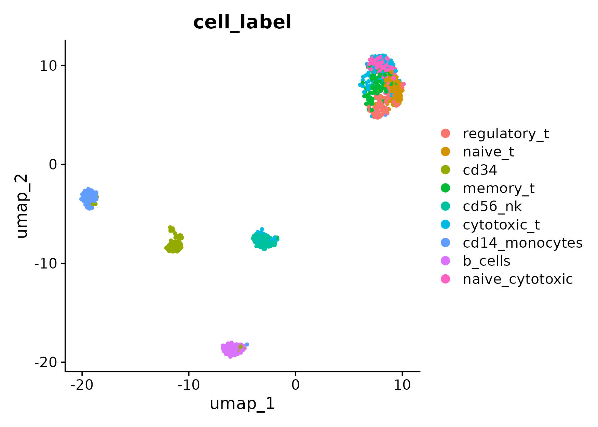
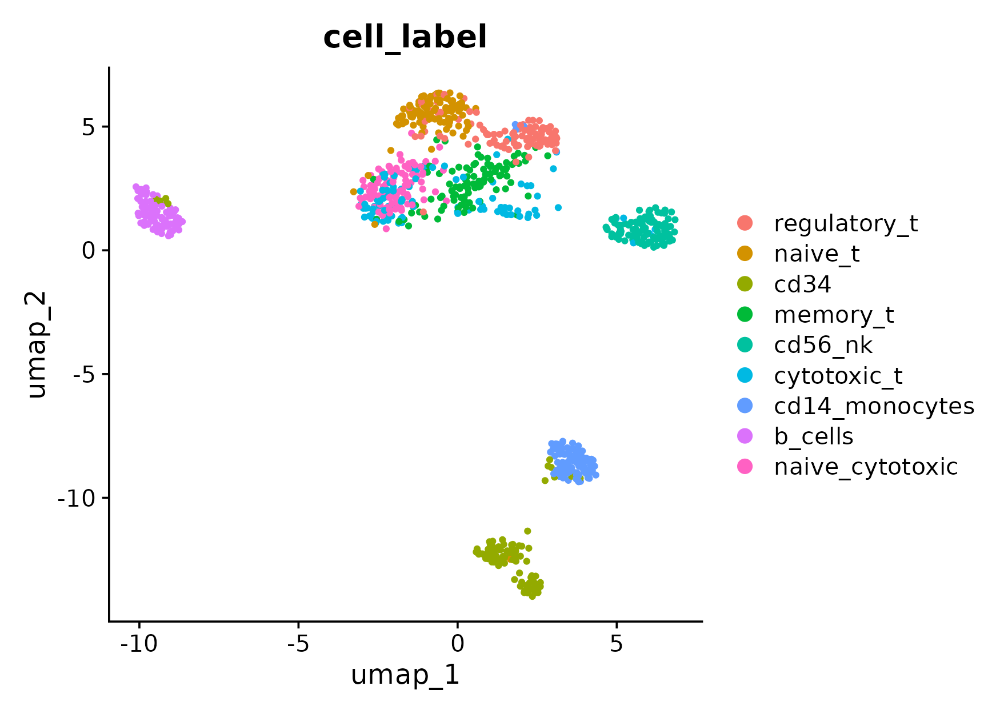

# mixhvg: Mixture of Highly Variable Gene Selection  

[](https://cran.r-project.org/package=mixhvg) [](https://cran.r-project.org/package=mixhvg)    

### Overview

The package **mixhvg** works for highly variable gene selection, including popular public available methods, and also the mixture of multiple highly variable gene selection methods. The mixture of methods can combine the advantages captured by each single method. 

This function **FindVariableFeaturesMix** inherits from  **FindVariableFeatures** function of Seurat Package, which can be used the same as FindVariableFeatures. Also, it accepts the dense or sparse matrix input. 

Find the tutorial website here https://mixhvg.github.io.  

### News

Sept. 1st, 2024: The package `mixhvg` is updated to version 0.2.1, which can support the use in Seurat version 5. 

Aug. 26th, 2024: Our paper is on biorXiv as a preprint version: [Zhao, R., Lu, J., Zhou, W., Zhao, N., & Ji, H. (2024). A systematic evaluation of highly variable gene selection methods for single-cell RNA-sequencing. *bioRxiv*, 2024-08.]( https://doi.org/10.1101/2024.08.25.608519)

### Download

Please download the [**mixhvg** package from CRAN](https://CRAN.R-project.org/package=mixhvg).

```R
install.packages("mixhvg")
```

Please use GitHub repo to download the most updated package.

```R
devtools::install_github("RuzhangZhao/mixhvg")
```

### Usage 

There are two inputs can be used in **FindVariableFeaturesMix** function. 

The example data comes from [10x Genomics](https://www.10xgenomics.com/resources/datasets/pbmc-from-a-healthy-donor-granulocytes-removed-through-cell-sorting-3-k-1-standard-2-0-0). You may use [this link](https://github.com/RuzhangZhao/pbmc3k/raw/main/pbmc3k_rna.rds) to download the processed data. The processed data is named as `pbmc3k_rna.rds`.

#### Seurat Object as Input

```R
pbmc<-readRDS("pbmc3k_rna.rds")
library(Seurat)
library(mixhvg)
object<-CreateSeuratObject(pbmc)
object<-FindVariableFeaturesMix(object,nfeatures=2000)
head(VariableFeatures(object))
# [1] "CD74"  "LYZ"   "IGLC3" "IGKC"  "RPS29" "IGHA1"
```

One may use **FindVariableFeaturesMix** to replace the **FindVariableFeatures** function in the analysis pipeline of Seurat. For example, 

```R
object<-CreateSeuratObject(pbmc)
object<-FindVariableFeaturesMix(object)
object<-NormalizeData(object,verbose=FALSE)
object<-ScaleData(object,verbose = FALSE)
object<-RunPCA(object,npcs=30,verbose=FALSE)
object<-RunUMAP(object,dims=1:30,verbose = FALSE)
```

#### Matrix as Input

```R
pbmc<-readRDS("pbmc3k_rna.rds")
library(mixhvg)
pbmc_hvg<-FindVariableFeaturesMix(pbmc,nfeatures=2000)
head(pbmc_hvg)
# [1] "CD74"  "LYZ"   "IGLC3" "IGKC"  "RPS29" "IGHA1"
```

#### Different Methods 

The `method.names` can take one method or multiple methods for mixture. 

```R
pbmc_hvg<-FindVariableFeaturesMix(pbmc,method.names="seuratv3")
pbmc_hvg<-FindVariableFeaturesMix(pbmc,method.names="scran")
pbmc_hvg<-FindVariableFeaturesMix(pbmc,
          method.names=c("scran","scran_pos","seuratv1"))
```


---


In the following example, we use a small cell sorting single-cell RNA-seq dataset with true label, downloaded from a large PBMC dataset. Download the example dataset using [this link](https://github.com/RuzhangZhao/data_pbmc_900). 

The data was provided by the work ([Wang, J., Agarwal, D., Huang, M., Hu, G., Zhou, Z., Ye, C., & Zhang, N. R. (2019). Data denoising with transfer learning in single-cell transcriptomics. *Nature methods*, *16*(9), 875-878.](https://www.nature.com/articles/s41592-019-0537-1)), which was initially downsampled from ([Zheng, G. X., Terry, J. M., Belgrader, P., Ryvkin, P., Bent, Z. W., Wilson, R., ... & Bielas, J. H. (2017). Massively parallel digital transcriptional profiling of single cells. *Nature communications*, *8*(1), 14049.](https://www.nature.com/articles/ncomms14049)).


Load the scRNA-seq data and its corresponding labels. 

```R
expr<-readRDS("pbmc_900.rds")
cell_label<-read.table("cell_labels.txt",header = T)
cell_label<-factor(cell_label$cell_type_labels,levels = c("regulatory_t","naive_t","cd34","memory_t","cd56_nk","cytotoxic_t","cd14_monocytes","b_cells","naive_cytotoxic"))
```

 There are in total 9 cell type labels, with 100 cells for each cell type. 

Here, we check the performance of two different HVG selection methods: Seurat v3 v.s. mixHVG. The evaluation is illustrated by the UMAP plots. 

First, we show the standard pipeline for visualizing the dataset with default Seurat pipeline. [Check Seurat tutorial for more details.](https://satijalab.org/seurat/articles/pbmc3k_tutorial)

```R
library(Seurat)

npcs=30
set.seed(1)
obj<-CreateSeuratObject(expr)
obj$cell_label<-cell_label
obj<-NormalizeData(obj,verbose=FALSE)
obj<-FindVariableFeatures(obj,verbose=FALSE)
obj<-ScaleData(obj,verbose=FALSE)
suppressWarnings(obj<-RunPCA(obj,npcs=npcs,verbose=FALSE))
obj<-RunUMAP(obj,dims = 1:npcs,verbose=FALSE)

pdf(paste0("umap_hvg_by_seuratv3.pdf"),height = 5.5,width = 7)
DimPlot(obj,reduction = "umap",group.by = "cell_label",shuffle = T)
dev.off() 

```




Second, we can simply replace the line `FindVariableFeatures` by `FindVariableFeaturesMix`  with package mixhvg loaded to apply the mixHVG method. 

```R
library(Seurat)
library(mixhvg)

npcs=30
set.seed(1)
pbmc<-CreateSeuratObject(expr)
pbmc$cell_label<-cell_label
pbmc<-NormalizeData(pbmc,verbose=FALSE)
pbmc<-FindVariableFeaturesMix(pbmc,verbose=FALSE)
pbmc<-ScaleData(pbmc,verbose=FALSE)
suppressWarnings(pbmc<-RunPCA(pbmc,npcs=npcs,verbose=FALSE))
pbmc<-RunUMAP(pbmc,dims = 1:npcs,verbose=FALSE)

pdf(paste0("umap_hvg_by_mixhvg.pdf"),height = 5.5,width = 7)
DimPlot(pbmc,reduction = "umap",group.by = "cell_label",shuffle = T)
dev.off() 

```




The evaluation is by adjusted rand index (ARI). [Refer to our paper for more details.](https://doi.org/10.1101/2024.08.25.608519)

```R
maxARI<-function(embedding,label){
    label = as.numeric(as.factor(label))
    snn_<- FindNeighbors(object = embedding,
                         nn.method = "rann",
                         verbose = F)$snn
    res<-sapply( seq(0,2,0.1) ,function(cur){
        cluster_label <- FindClusters(snn_,resolution = cur,
                                      verbose = F)[[1]]
        mclust::adjustedRandIndex(cluster_label,label)})
    max(res)
}

ari_seuratv3<-maxARI(obj@reductions$umap@cell.embeddings,cell_label)
ari_mixhvg<-maxARI(pbmc@reductions$umap@cell.embeddings,cell_label)
```

ARI for UMAP with HVG selection by Seurat v3 is **0.6348**

ARI for UMAP with HVG selection by mixHVG is **0.6767**

---


### Method Choices

The following methods can be chosen. And also, any mixture of the following methods is acceptable. For example, the default is c("scran","seuratv1","mv_PFlogPF","scran_pos")

*  **scran**: Use mean-variance curve adjustment on lognormalized count matrix, which is scran ModelGeneVar.
* **mv_ct**: Use mean-variance curve adjustment on count matrix, inherited from scran ModelGeneVar.
* **mv_nc**: Use mean-variance curve adjustment on normalized count matrix, inherited from scran ModelGeneVar.
* **mv_lognc**: The same as scran.
* **mv_PFlogPF**: Use mean-variance curve adjustment on PFlog1pPF matrix, inherited from scran ModelGeneVar.
* **scran_pos**: Use scran poisson version, modelGeneVarByPoisson.
* **seuratv3**: Use logmean-logvariance curve adjustment on count matrix, which is vst, Seurat FindVariableFeatures Function(https://satijalab.org/seurat/reference/findvariablefeatures).
* **logmv_ct**: The same as seuratv3.
* **logmv_nc**: Use logmean-logvariance curve adjustment on normalized count matrix, inherited from seuratv3(vst).
* **logmv_lognc**: Use logmean-logvariance curve adjustment on lognormalized count matrix, inherited from seuratv3(vst).
* **logmv_PFlogPF**: Use logmean-logvariance curve adjustment on PFlog1pPF matrix, inherited from seuratv3(vst).
* **seuratv1**: Use dispersion on lognormalized count matrix, which is dispersion (disp), Seurat FindVariableFeatures Function(https://satijalab.org/seurat/reference/findvariablefeatures).
* **disp_lognc**: The same as seuratv1.
* **disp_PFlogPF**: Use dispersion on PFlog1pPF matrix, inherited from seuratv1(disp).
* **mean_max_ct**: Highly Expressed Features with respect to count matrix.
* **mean_max_nc**: Highly Expressed Features with respect to normalized count matrix.
* **mean_max_lognc**: Highly Expressed Features with respect to lognormalized count matrix


